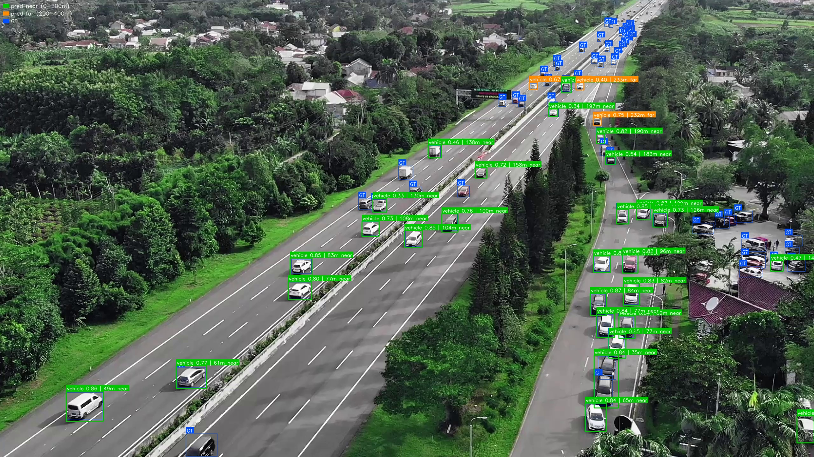
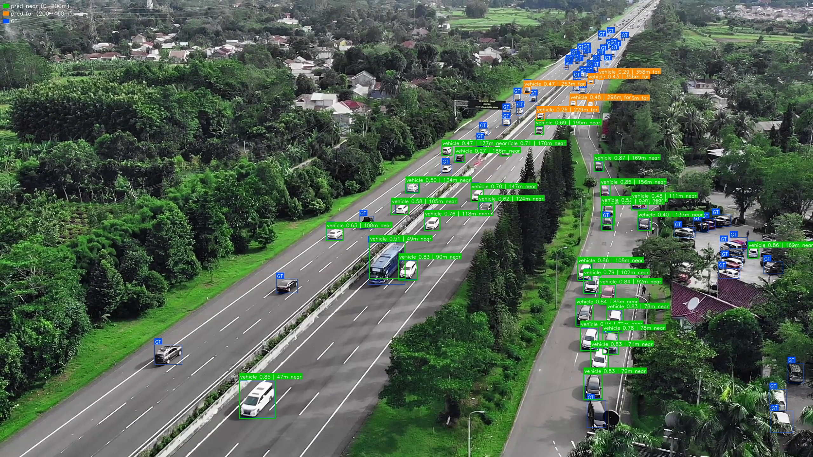
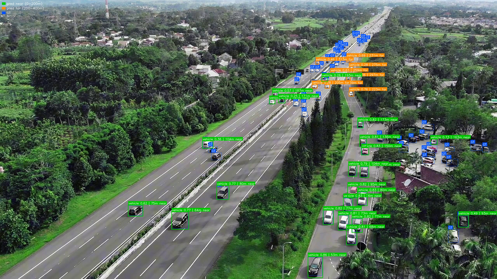

# Vehicle Detection on Drone Video — Auto-Labeling Pipeline


> **Disclosure:** AI coding assistants were used throughout this work, with all design decisions reviewed and directed
> by me.

## 1. Overview

Full pipeline for detecting vehicles in drone footage:

video → frames → pretrained teacher model (pseudo-labels) → manual cleanup →
single-class (`vehicle`) object detector → evaluation on a held-out eval clip,
with metrics reported separately for two distance bands (0–200 m and 200–400 m).

The goal is a **correct, transparent, reproducible pipeline** rather than a
maximized leaderboard score. No pretrained aerial datasets (VisDrone, AU-AIR,
UAVDT, etc.) were used for training — only a pretrained general-purpose model
(COCO-trained YOLO) as a *teacher* for pseudo-labeling.

> **Note:** auto-labeling (teacher-model inference to generate pseudo-labels)
> is done with an external tool/program, outside this repo. This repo picks up
> the pipeline from the resulting label files (`data/labels/train/`,
> `data/labels/eval_gt/`) onward — see section 4 below.

## 2. Repository Structure

```
repo/
  README.md
  requirements.txt
  data.yaml
  .gitignore
  configs/
    train_config.yaml
  scripts/
    extract_frames.py       # video -> frames (+ frames_index.csv sidecar)
    clean_labels.md          # manual cleanup process notes
    distance_utils.py        # bbox size -> distance (m) -> band
    train.py                 # train the vehicle detector
    evaluate.py               # eval clip -> TP/FP/FN -> metrics by band
    render_predictions.py     # example images / overlay video
  data/
    videos/{train,eval}/      # source clips (gitignored, see below)
    frames/{train,eval}/      # extracted frames + frames_index.csv
                               # (frame images and the external tool's raw
                               # per-frame .json output are both gitignored;
                               # only the .csv timestamp index is kept)
    labels/train/
      images/                 # cleaned training frames
      labels/                 # cleaned pseudo-labels (YOLO .txt), produced
                               # by an external auto-labeling tool + manual
                               # cleanup
      train.txt, val.txt      # regenerated by train.py on every run
                               # (gitignored, along with labels.cache)
    labels/eval_gt/
      images/                 # manually finalized eval GT frames
      labels/                 # manually finalized eval GT labels (YOLO .txt)
  runs/
    metrics.json
    metrics_table.md
    detect/                    # raw ultralytics training run artifacts
                                # (plots, curves, per-run weights; gitignored)
  examples/
    (eval prediction images / short overlay video)
  weights/
    best.pt                    # final selected checkpoint (committed)
    <other-candidate>.pt       # other trained variants (gitignored, local only)
```

## 3. Dataset

- **Source:** 5 drone videos of roads/traffic.
- **Train videos (4):** `train_1.mp4`, `train_2.mp4`, `train_3.mp4`, `train_4.mp4`
  (`data/videos/train/`) — 94 frames extracted total (25/17/32/20 per clip).
- **Eval video:** the eval set actually consists of **two** clips,
  `eval.mp4` (30 FPS, 2160×3840 portrait) and `eval_1.mp4` (60 FPS, 2560×1440
  landscape), both under `data/videos/eval/`. Both are treated as a single
  combined held-out eval set (pooled for TP/FP/FN/precision/detection-rate/
  mAP; "time to first detection" is computed per-video since it's inherently
  a single-timeline notion — see section 7). 47 GT frames total (31 from
  `eval` @ 1 FPS, 16 from `eval_1` @ 1 FPS).

## 4. Auto-Labeling

- **Tool/program used:** X-Anylabeling.
- **Teacher model:** by Grounding-Dino.
- **Source classes used:** vehicle .
- **Confidence threshold:** 0.15.
- **Manual cleanup performed:** Removed obvious false-positive boxes (non-vehicle objects, duplicate boxes), Added missed vehicles that the teacher model did not detect, Corrected inaccurate/loose bounding boxes, Removed/relabeled ambiguous cases (parked vs. moving, partially occluded, edge-of-frame).

## 5. Training

- **Model architecture:** YOLO11-medium (`yolo11m.pt`, Ultralytics, COCO-pretrained).
- **Number of frames used:** 94 (all cleaned training-video frames).
- **Train/val split:** 80/20 **per source video**, holding out the *last*
  (most recent in time) 20% of each video's frames for validation rather than
  a random frame-level split. Consecutive drone-video frames are highly
  correlated, so a random split would leak near-duplicate frames between
  train/val and give an overly optimistic validation score; a per-video
  temporal holdout is a more honest approximation of unseen data while still
  using every training video. Implemented in
  `scripts/train.py::build_train_val_split`, regenerated automatically from
  whatever is in `data/labels/train/images/` each time training runs. This is
  a *training-time* val split only — unrelated to, and not to be confused
  with, the fully held-out eval clips (never touched here).
- **Training parameters:** see `configs/train_config.yaml`.
- **Augmentation:** a deliberately limited, explicit set (everything else
  Ultralytics enables by default — mosaic, mixup, copy-paste, shear,
  perspective, hue jitter, vertical flip — is turned off):
  - horizontal flip (`fliplr=0.5`)
  - light brightness/contrast jitter via HSV (`hsv_v=0.3` for brightness;
    Ultralytics has no literal "contrast" knob, so `hsv_s=0.3`, saturation,
    is used as the closest built-in stand-in)
  - light scale jitter (`scale=0.15`)
  - light translation (`translate=0.08`)
  - small rotation (`degrees=8`)
- **Resulting weights:** `weights/best.pt`, copied automatically at the end of
  `scripts/train.py` from the Ultralytics run directory.

## 6. Distance Estimation

Since no useful info about distance is available, distance is approximated from bbox
pixel size (see `scripts/distance_utils.py`).

**Assumptions:**
- Average vehicle length ≈ 4.5 m
- Camera horizontal FOV ≈ 90° (measured/known spec for this drone camera —
  supersedes the task brief's generic near 80°-100°)

**Formulas:**

```
f_px = frame_width_px / (2 * tan(horizontal_FOV / 2))
distance_m = real_vehicle_length_m * f_px / bbox_size_px
bbox_size_px = max(box_width_px, box_height_px)
```

**Distance bands:**
- 0–200 m → `near`
- 200–400 m → `far`
- \>400 m → ignored for these metrics

**Caveats:** this is a rough monocular-geometry approximation — it assumes a
perfectly nadir (straight-down) camera and a fixed vehicle length for every
detected box, so it will be systematically off for non-nadir viewing angles,
unusually long/short vehicles (trucks/buses vs. motorcycles), and any lens
distortion is not modeled.

## 7. Evaluation Methodology

- **TP / FP / FN:** for each eval frame, predictions are greedily matched to
  GT boxes (highest-confidence prediction first, matched to its
  highest-IoU still-free GT box) with IoU ≥ 0.5 → match (TP). Unmatched GT →
  FN. Unmatched predictions → FP. Implemented in
  `scripts/evaluate.py::match_predictions_to_gt`.
- **Distance band assignment:** TP/FN use the **GT box**; FP (no matching GT)
  uses the **predicted box**. Boxes estimated at >400 m are dropped entirely
  from the near/far table (per task spec), but still participate in matching.
- **IoU threshold:** 0.5 (`--iou`, default).
- **Confidence threshold:** 0.25 (`--conf`, default) — **fixed a priori and
  never tuned against the eval clips** (would count as threshold tuning on
  eval data, which is disallowed).
- **Eval sampling rate:** ~1 FPS per eval video (see section 3), per the
  task's "for simplicity" recommendation.
- **Multiple eval clips:** `eval.mp4` and `eval_1.mp4` are pooled together for
  all TP/FP/FN-derived metrics (detection rate, precision, false alarms/min,
  mAP@0.5). `N_frames` in the false-alarms/min formula is the combined frame
  count across both (47).
- **Time to first detection:** per band, time from first GT appearance in that
  band to the first correct (TP) detection in that band. Computed **per video**
  (each clip has its own t=0) in `scripts/evaluate.py`, then averaged across
  videos that have a defined value for the final table; per-video values are
  also kept in `runs/metrics.json` / `runs/metrics_table.md` for transparency.
- **mAP@0.5 (bonus):** computed by pooling every prediction across both eval
  clips (excluding boxes in the >400 m "ignore" band) into one precision/recall
  curve, then integrating it with the standard monotonic-envelope
  (VOC-2012-style) method — see `scripts/evaluate.py::compute_average_precision`.
- **Eval clip usage:** the eval clips were **never** used for training,
  threshold tuning, or model selection. They were only auto-labeled
  (bootstrapped, via the external tool) and then manually finalized as GT
  **after** training was complete.

## 8. Metrics

Full breakdown (incl. raw TP/FP/FN counts and per-video time-to-first-detection)
in `runs/metrics_table.md` / `runs/metrics.json`. Weights: `weights/best.pt`
(YOLO11m), IoU threshold 0.5, confidence threshold 0.25, evaluated once on the
never-touched eval clips (`eval.mp4` + `eval_1.mp4` pooled, 47 frames @ ~1 FPS):

| Metric | 0-200 m | 200-400 m |
|---|---|---|
| Detection rate | 59.1% | 23.6% |
| Precision | 76.3% | 92.8% |
| False alarms / min | 188.94 | 8.94 |
| Time to first detection (s) | 0.00 | 0.00 |

**mAP@0.5 (bonus, both bands combined):** 0.509

These numbers reflect a small, quickly-cleaned pseudo-labeled dataset (94
training frames) and are expected to improve with more labeled data / cleanup
passes; see section 11 for discussion. The very high "false alarms / min" in
the near band mainly comes from spurious detections on static roadside
clutter (signs, poles) visible in the example predictions below.

## 9. Example Predictions

Generated with `scripts/render_predictions.py` (predictions in green/orange by
distance band, GT in blue), from the eval set:





A short annotated video of the detector running on an eval clip can be
generated with (see section 10 below):

```bash
python scripts/render_predictions.py --weights weights/best.pt \
    --video data/videos/eval/eval_1.mp4 --out-video examples/eval_prediction.mp4
```
Or see it on youtube:

- https://youtu.be/8vfB-2jURz0
- https://youtu.be/PXADv30NEYk
- https://youtu.be/OpuUgno7WTE


## 10. How to Reproduce

```bash
pip install -r requirements.txt

# 1. Extract frames from each training video
python scripts/extract_frames.py --video data/videos/train/<clip>.mp4 --out-dir data/frames/train/<clip> --fps 1

# 2. Generate pseudo-labels using the external auto-labeling tool (not part of this
#    repo), pointing it at data/frames/train/<clip> and writing YOLO-format labels
#    into data/labels/train/labels/<clip>

# 3. Manually clean labels (see scripts/clean_labels.md)

# 4. Train the detector
python scripts/train.py --config configs/train_config.yaml

# 5. Prepare eval GT: extract eval frames, run the external auto-labeling tool
#    on them as a starting point, then manually finalize as GT — AFTER training.
#    Finalized images+labels live in data/labels/eval_gt/{images,labels}/.
python scripts/extract_frames.py --video data/videos/eval/<clip>.mp4 --out-dir data/frames/eval --fps 1

# 6. Evaluate (pools eval.mp4 + eval_1.mp4; --videos-dir is only used to look up
#    each clip's source FPS for timestamp/time-to-first-detection purposes)
python scripts/evaluate.py --weights weights/best.pt \
    --eval-images data/labels/eval_gt/images --eval-labels data/labels/eval_gt/labels \
    --videos-dir data/videos/eval --conf 0.25 --iou 0.5 \
    --out runs/metrics.json --out-table runs/metrics_table.md

# 7. Watch the detector run on a video live, and save the annotated result
python scripts/render_predictions.py --weights weights/best.pt \
    --video data/videos/eval/eval_1.mp4 --out-video examples/eval_prediction.mp4
#    (press 'q' in the preview window to stop early; pass --no-show for a headless run)

# 8. Render a few annotated example images (predictions + GT overlay) from the eval set
python scripts/render_predictions.py --weights weights/best.pt \
    --eval-frames data/labels/eval_gt/images --eval-labels data/labels/eval_gt/labels \
    --out-images examples/ --num-examples 6
```

## 11. Conclusions & Possible Improvements

- **Training image size matters a lot for this kind of footage.** Drone
  video shrinks vehicles down to a handful of pixels, especially in the
  200–400 m "far" band, so a larger `imgsz` at both training and inference
  preserves detail that would otherwise be lost to downscaling. In this
  pipeline, runs trained at a larger `imgsz` consistently handled small/
  distant vehicles better than smaller-`imgsz` runs — for this type of
  aerial imagery, pushing `imgsz` as high as the GPU/time budget allows is
  worth prioritizing over most other hyperparameter tuning.
- **Model selection.** Three model variants were trained end-to-end
  (varying input resolution and augmentation settings) and each was run
  through the exact same evaluation described in section 7, on the same
  never-touched eval clips. The best-performing variant was kept as
  `weights/best.pt`; the other checkpoints were discarded.
- **Augmentation didn't pay off within the available time.** At the same
  `imgsz=960`, the augmented and non-augmented runs behave quite
  differently: augmentation made the model much more conservative —
  precision improved (66.7%→76.3% near, 75.7%→92.8% far) and false
  alarms/min dropped sharply (312.8→188.9 near, 70.2→8.9 far), but detection
  rate dropped with it, especially in the far band (44.8%→23.6%); see
  `runs/metrics_table_no_aug_data.md` vs `runs/metrics_table_aug_data.md`
  for the full breakdown (compared at slightly different conf/IoU
  thresholds, so read the comparison as directional, not perfectly
  controlled). Given more training time — more epochs and/or a gentler
  augmentation schedule — the augmented run would likely have closed that
  recall gap while keeping its precision advantage; it simply wasn't
  brought to a competitive state in time, so the **non-augmented**
  `imgsz=960` run is the one shipped as `weights/best.pt` for section 8.
- **One eval clip is a partial domain mismatch.** Training video is
  dominated by small, distant vehicles from a high, wide-area shot, while
  `eval_1.mp4` (one of the two linked eval clips) was shot much closer/
  lower, so vehicles occupy a noticeably larger fraction of the frame than
  anything seen in training. This is a genuine train/eval distribution
  shift rather than a labeling or metric bug, and is a likely contributor
  to the errors visible on that clip in the examples below — worth stating
  plainly rather than only showcasing clips that match the training
  distribution.
- **With more time**, the next thing worth trying is not another YOLO
  variant but a different architecture family entirely: a vision-transformer
  detector such as **RF-DETR (Roboflow)**. Transformer-based detectors
  handle dense, small-object scenes like this drone footage differently
  from CNN-based YOLO, and would be a useful comparison point both for raw
  accuracy and for the near-band false-alarm/clutter issue noted in
  section 8.
- **Overall**, this pipeline optimizes for an honest, reproducible
  end-to-end story rather than a maximized score: every metric in section 8
  is measured once on genuinely held-out video, with every assumption and
  limitation (distance-estimate geometry, small training set, ~1 FPS
  sampling) stated explicitly rather than hidden.
